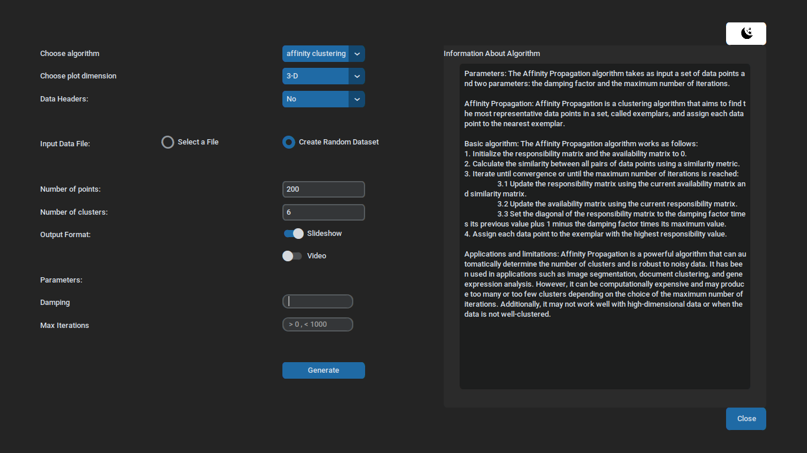

# Clustering_Visualizer



## Description
This is a simple tool to visualize the clustering of a dataset. It is based on KMeans algorithm, DB Scan algorithm and Affinity Propagation algorithm. All the algorithms are implemented manually, can be found in the src/algorithms folder. The tool is implemented in Python and uses the Custom TKinter Library. It supports the following features:
- Load a dataset from a file (csv/xls/xlsx/mat format)
- Visualize the dataset in a 2D/3D plot
- Apply KMeans, DB Scan and Affinity Propagation algorithms
- Generate the output of clustering as a video/slideshow
- In case of no dataset, the tool can generate a random dataset
- In case the dataset has more than 2 attributes apply PCA to reduce the dimensionality of the dataset


## Running the tool
To install the tool, you need to have Python 3.7 or higher installed on your machine. Then, you can install the required packages by running the following command:
```bash
bash -f run.sh
```

## Alternative Installation
If the above command does not work, you can install the required packages manually by running the following commands:
```bash
rm -rf pll_env
python3 -m venv pll_env
source pll_env/bin/activate
pip install -r requirements.txt
deactivate
pll_env/bin/python3 src/main.py     
``` 

`Note: The above commands are for Linux. Further they must be used while in the root directory of the project (the one where this README.md and the run.sh files are located).`


## Authors
- Prakhar Pandey
- Siddharth Khincha
- Viraj Goenka
- Pradeep Kumar
- Tanveen Dhingra


